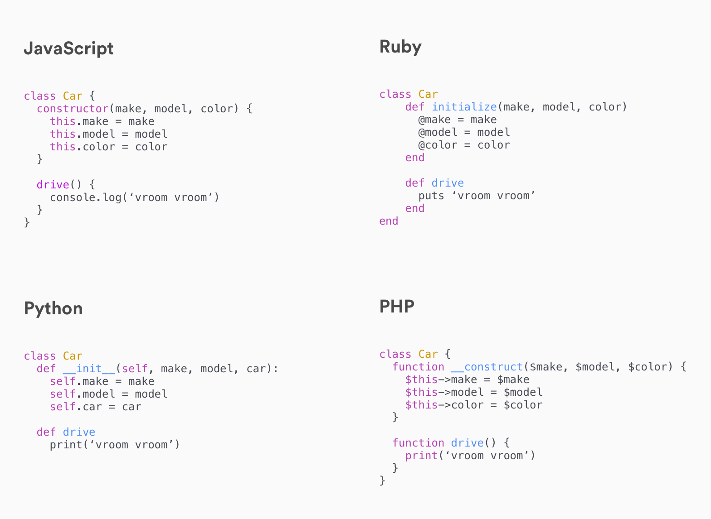

[](https://generalassemb.ly/education/web-development-immersive)

# Object Oriented Programming & Classes

The earliest computer programs were written in an imperative style. The programs
were a series of instructions that changed a program's state. Data was loaded
into the computer, the program ran and manipulated the data, and some output was
produced. The first JavaScript programs we wrote followed this imperative style.

The way that we sometimes think about programming follows imperitive style too.
Have you ever heard of the example of writing a program for a computer to make a
peanut-butter and jelly sandwich? Part of Harvard's intro to computer science
class is having students write a program to tell a computer to make a
peanut-butter and jelly sandwich.


The message is two part: programming is communicating instructions to a computer
and these instructions should follow the format of a recipe. That
programming-as-a-recipe style of thinking is imperative programming and it's
wrong. That's not what we want to do. We don't have time for that.

Large applications written in an imperative style become confusing to build and
maintain. To consider the current state of our application, we need to consider
all of the code that has run so far. That becomes increasingly difficult as the
application grows.

> [Good article explaining the difference between imperative and declarative programming](https://tylermcginnis.com/imperative-vs-declarative-programming/)

## Prerequisites

- Objects
- Context

## Objectives

By the end of this, developers should be able to:

- Answer the question, what is Object-Oriented Programming (OOP)?
- Identify and define: a class, an instance, a constructor

## What is Object Oriented Programming

Object oriented programming is a paradigm of Software Engineering that attempts
to solve the problems of building applications imperatively by organizing
applications into discrete units, called objects. Rather than imperatively
describe everything we want our application to do, in OOP we define objects that
represent our understanding of the different parts of our application, what
information describes those parts and what behavior those parts have.


> Source:
> [Simple Snippets](https://simplesnippets.tech/java-introduction-to-object-oriented-programming-oop/)

Every object stores and manages any state or data relevant to itself internally.
We almost always have many instances of a type of object.

We use methods to initialize, modify, or act on an objects' internal state.

Because these methods will be the same across all instances of a type of object,
we define a **single class** with all of this behavior described in one place.

We then use that class to instantiate as many instances (objects) of the class
as we need.

Object oriented programming gives use three major benefits:

- **Encapsulation**: The complexity of our objects is hidden and a user can
  interact with a well defined set of methods. We can redefine internal behavior
  without changing anything externally - a huge benefit for refactoring.
- **Modularity**: Because the interface (set of methods) for an object is well
  defined, it is easy to exchange one object for another and reorganize objects
  without breaking them.
- **Inheritance**: Object Oriented design lets certain classes inherit from, or
  borrow the behavior of another, more general class. The inheriting class can
  add and overwrite inherited methods.

You can think of an object as a little machine: it has displays you can read and
buttons you can push. When you write an object-oriented application, you are
modeling the entire program as the interactions of these machines.

> Parts of this class are adapted from Dr. Ana Bell's
> [Introduction to Programming in Python class at MIT](https://youtu.be/-DP1i2ZU9gk).

## Scenario: Rent-A-Car

The Rent-A-Car company has contracted you to build a web application they can
use to manage renting out their cars to customers. Their current fleet is 100
cars of a few different makes and models.

Right off the bat, lets say they want to expand their fleet. Do we want to have
to go in and create a new object literal (`{}`) for every new car they add?

<details>
  <summary>Discussion</summary>

We probably don't want to create an object literal (`{}`) for every new car,
though we will want some way of representing each car inside of our application.

Every car object is going to have some common characteristics and some makes and
models might have distinct characteristics.

What if we had a template for what a car object should look like that we could
use whenever we needed to represent a particular car in our application? That template is called a **class**.

</details>

## OOP Vocabulary

### Classes and Instances

Classes (sometimes referred to as Types) are the fundamental building block of
OOP. A class is a type of object (the template from above). You've already
worked with some: i.e. Arrays, Numbers, Strings. Those classes are built in to
the language. We never had to define what an Array was or what methods it had,
we could just start creating arrays. The arrays we created are all **instances**
of the Array **class**.

The distinction between classes and instances may seem foreign and technical
but, in reality, it is very similar to how we think about the real world: I can
say "imagine a car" and we have no problem doing so. I can also point at
something, ask "is that a car?" and get near universally consistent answers. We
can even look at a blueprint for the car and it will have a description, a basic
drawing, and technical specifics about the car it represents.

The general idea of a car is a class; each individual car is an instance:


### Attributes and Methods

If we want to create our own classes, all we need is a name for our class and a
definition of the information and behavior we want to encapsulate in our class.
The information and behavior we want to describe with our class has a special
name: an **attribute**. There are two kinds of attributes: data attributes and
procedural attributes (more commonly called **methods**).

For the Rent-A-Car application we're building, we'll need a class for our
client's cars (a `Car` class). Our class definition will include all of the
attributes and methods we want for every car. Here is a list of the attributes
and methods we could include:

**Attributes:**

- Make
- Model
- Year
- Colors
- Mileage
- Fuel Level

**Methods:**

- Drive
- GPS
- Fill Fuel Tank

### Constructor

We can think of our class definition as a template for what we want each
individual instance of that class to look like. But how will we use our class
definition to actually create instances of that class?

The last thing our class definition needs is a **constructor**: a special method
that will be invoked whenever we create a new instance of our class. If our
class is what defines our template, the constructor method is what fills it in
for a particular instance.

#### Self (or `this`)

We'll need some placeholder reference for each instance that has yet to be
created with our new class definition. In most OOP languages, this is referred
to as `self`, though in JavaScript it's `this`.

Why do we need this placeholder? Well, each car we create with our Car class
will have it's own make and model. When we want to represent that in our class
definition, we want to represent that the make and model are part of the class
but the _values_ for make and model are part of the instance of that class. So
we'll attach these values to a placeholder (`self` or `this`, depending on the
language) and when our constructor method is invoked, it will attach those
values on the new object.

### All Together

Here is how we define a class in JavaScript, Ruby, Python, and PHP. Note the
similarities:



The Car class defined above in JavaScript, Ruby, Python, and PHP (all popular
languages for the web) have each of the concepts we've discussed.

In all four languages, we use the shared `class` keyword to define our class.
Class names are always capitalized: a class in an application is typically
something important and we want to make it distinct from an instance. Think of
it as a proper noun!

All four class definitions have a couple of attributes and methods. Each has a
`make`, `model` and `color` attribute as well as a `drive` method.

Finally, each class definition has a constructor function. In JavaScript, this
is the `constructor` method; in Ruby, this is the `initialize` method; in
Python, this is the `__init__` method; in PHP, this is the `__construct` method.
Note that each also has a way of referencing the placeholder object that will be
created: `this` or `$this` in JavaScript and PHP; `self` in Python and Ruby (not
shown in Ruby).

The concepts we've discussed here apply across multiple languages. Object
Oriented Programming is a paradigm (a way of thinking) for building applications
in any language.

## I Do: Create a Class & Instances

We know that we need a way to define a class with
attributes and methods, create instances of that class and then define some way
of creating sub-classes based on a parent class. Let's get to it!

<!-- Follow along to the examples below in [JS OOP
Practice](https://git.generalassemb.ly/dc-wdi-fundamentals/js-oop-practice). The
exercise you will be completing are also in that repository. -->

## Classes in ES6

Now that we have created a class, let's review how it is created. The syntax looks like this:


> The above figure shows how to define a simple class using JavaScript. The
> Class is defined using the `class` keyword and given a name (in this case
> `Car`). The `constructor` function accepts three parameters (`make`, `model`,
> and `color`) and sets these as attributes. The class also contains a `drive`
> method.

Notice the use of `this` and the fact that we're not returning from the class?

When we want to generate instances of this class, we'll use the `new` keyword:

```js
const carolla = new Car('Toyota', 'Carolla', 'Grey')
const outback = new Car('Subaru', 'Outback', 'Forest Green')
```

The `new` keyword will automatically:

1. Create a new, empty object for us
2. Generate a context for that object (`this` = the new object)
3. Return the object instance from our class

## [License](LICENSE)

1. All content is licensed under a CC­BY­NC­SA 4.0 license.
1. All software code is licensed under GNU GPLv3. For commercial use or
   alternative licensing, please contact legal@ga.co.
