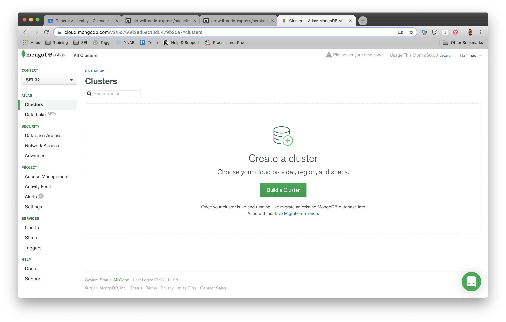

# Deploying Node and MongoDB to Heroku


## Learning Objectives

- Define deployment
- Describe the difference between development, test, and production environments
- Use environmental variables to keep sensitive data out of code
- Set up a Mongoose database using Atlas
- Deploy a Node App using Heroku

## About Deployment

### What is Deployment?

Deployment is the act of putting an app up on one or more internet-connected
servers that allow users to access and use the app.

_Question:_ What changes in an application when it is deployed?

### Requirements for Deployment

There are generally a few things we need for an app to be properly deployed:

- **Server** - the server(s) must be on and connected to the internet
- **Executable Code** - we must get our code onto the server and be able to run it
- **Dependencies** - the server(s) must have the proper dependencies installed
- **Services** - the server(s) must be running the correct services (web, database, email, etc.)
- **Configuration** - we must configure our running app with respect to its deployment environment

### Deployment Approaches

There are lots of ways to do each of these steps. For example, we can get our
code onto a server by...

- Using FTP (File Transfer Protocol) to transfer the files onto the server
- Adding a git remote repository and using `git push` to transmit files (like with GH pages)
- Putting the files on a flash drive, fastening it to a homing pigeon's leg,
  then having an operator receive the pigeon and copy the files over to the server

## Environments and Environmental Variables

### Environments

Application environments are an important part of the context in which an application runs.
Each environment is configured to support a certain usage of the application.

Typical application environments include:

- **Development** - environment where an app or new feature(s) are created and run locally
- **Test** - environment where code and UI is tested for functionality and performance
- **Production** - environment for complete and tested code to be hosted online for clients to use

So far, we haven't been specifying any environment.
Today we'll look at deploying to the `production` environment, 
a.k.a. the public, published version of our site.

Each environment has a different set of configurations, things that vary
depending on how we're running or using our app. We could be developing,
testing, or deploying our apps. Configuration settings often include...

- The name of the database
- The username/password to connect to the database
- API authentication keys (e.g. to connect to twitter API)
- Whether or not to reload code on each request (for debugging vs performance)
- Where to save log information (error logs, etc)

### Environmental Variables

We do not want to keep configuration in our codebase (e.g. the code we see when
we push to GitHub) for several reasons:

- We do not want to expose private information such as passwords and API Keys.
- When we push the same code to differnt environments, we need a way to
  dynamically tell which environment we're in.

Node manages application environments using "environmental variables".

Environmental variables store data and configuration information that is defined
outside of your codebase and pertain to the phase of the application's
development.

Storing this information separately protects sensitive information like API keys
and passwords because it is not visible from your project directory.

This is accomplished using `process`, a global object that comes with all node
projects. `process` has a property `env` where we store environmental variables.

We can view a project's environmental variables using the node repl in our
terminal. In your terminal,

```bash
$ cd <your-node-project>
$ node
> console.log(process.env)
```

- _Question:_ What are some of the listed variables? Why would they be stored here?

You can create a new environmental variable in the terminal too! (terminal, not node!)

```bash
$ export <YOUR_ENVIRONMENTAL_VARIABLE_NAME>=<variableValue>
```

#### Note:

- Make sure there are no spaces next to the equals sign!

- Environment variables tend to be SCREAMING_SNAKE_CASE by convention.

To test, try logging the following code from the node repl.

```js
> process.env.<YOUR_ENVIRONMENTAL_VARIABLE_NAME> = // whatever
```

If you'd like, you can also remove the environmental variable by exiting out of
the Node CLI and entering this command in the normal terminal:

```bash
$ unset <YOUR_ENVIRONMENTAL_VARIABLE_NAME>
```

#### `dotenv`

[dotenv](https://github.com/motdotla/dotenv) is a Node package used to store sensitive information in the environment.
It is a fantastic practice, and accords with [12-factor principles](https://12factor.net/).


## Deploying Applications

Deploying our Node-Express-Mongoose application consists of 2 sets of steps.
First, we'll sign up for Heroku, download the Heroku CLI, and set up a Mongo
database that our app can connect to. Next, we'll configure our
Node-Express-Mongoose applications to connect to this new cloud-hosted database
and finally, deploy our application to Heroku.

## You Do: Deploy Your App

Today, we will be deploying the 'main' branch of your API.

#### Note About Branches:

  When you clone a repo, it will clone down the main or master branch of a given
  repository. However many repos contain branches. Running the command on a
  cloned branch `git checkout bork` would switch the current git branch to
  the `bork` branch. This is useful for isolating the development of new features!

### Heroku

We'll be using a service called Heroku to deploy our apps, because it makes all
the steps for deployment easy, simplifying and expediting the process. For
example, Heroku automatically does the following...

- Starts up a new server when we run `heroku create`, and installs all the necessary services
- Adds a new remote to our Git repo, so we can just run `git push heroku master` to copy our code over
- Detects our database
- Detects the language our program is written in and chooses a buildpack
- Automatically installs our app's dependencies, and starts our app
- Easily change configuration information using `heroku config`

Heroku also has a FREE pricing tier!

### Mongo Atlas

[Mongo Atlas](https://cloud.mongodb.com) is a cloud-based database service that
hosts a protected MongoDB instance that you can easily integrate with an
application deployed on Heroku.

Today, you will need to set up an Atlas account and database to host your database.

### Deployment in 19 Easy Steps

Deployment is essentially an exercise in following directions. Follow the
step-by-step instructions below to deploy your app. Pay attention to
the notes following each prompt! Fully read each prompt (including the notes)
before executing each step.

#### Set up Heroku

1. Sign up for a free [Heroku](https://www.heroku.com/) account.

2. Follow the instructions
   [here](https://devcenter.heroku.com/articles/heroku-cli) to download the
   Heroku CLI.

   > NOTE: In your terminal, you will run the command
   > `brew tap heroku/brew && brew install heroku`

3. From your project directory, create an app on Heroku

   ```bash
   $ heroku create <your-app-name>
   ```

   ##### NOTE:

   - Make sure you are in your project's directory before you run this command!

   - NOTE: `heroku create` prepares Heroku to receive your code. Heroku will
     randomly create an app name for you if you don't specify one. You may need
     to login before you can create an app. To do this, run the command
     `heroku login`. This will prompt you to log in through your browser.

   - NOTE: If you choose to name your application, you will need to use a unique
     name (something someone else has not used before). If the name is taken,
     Heroku will prompt you to choose something new.

#### Set up MongoDB Atlas

4. Go to [Mongo Atlas](https://cloud.mongodb.com) and sign up for an account, or
   sign in if you have one already.

5. In the sidebar on the left, open the dropdown menu title `context` and select
   `New Project`. Give it a name and click `Create Project`. You can leave the
   defaults in the "Create a Project" page and hit the "Create Project" button.

   

6. Finish creating your new project and click the `Build a Cluster` button. **Be
   sure to select the free option for building your cluster!** Otherwise, leave
   all the default settings. Your cluster could take a few minutes to to finish
   building.

   

7. When your cluster is finished, click the "Connect" button.

8. Add `0.0.0.0/0` for the whitelisted IP address. This represents all of the IP
   addresses on your local machine. If you just add the current IP address you
   can click on "Network Access" in the sidebar, then the "Add IP Address"
   button in the top right, and finally "Allow Access from Anywhere" and click
   Confirm.

##### NOTE:

- If you forget to whitelist the IP, go to "Network Access" under "Security" on
  the left sidebar. Next select "Add IP Address" in the top right corner, and
  there should be a "Allow Access from Anywhere" button (or you can enter
  `0.0.0.0/0` manually).

9. Also create a username and password. **Remember the username and password you
   use for your database, you'll need them in a later step!**

   Go to "Database Access" under "Security" on the left sidebar. Then hit the
   "Add New User" button on the top right.

   ##### NOTE:

   - This is **not** the user with which you logged in to Atlas. "User" refers
     to an app that has access to your database, and **not your Atlas
     account/username**.

   - Create a Database username and Database password that you will remember, or
     write it down somewhere. You will need this information again later.

   - Do not use any special characters! Special characters can complicate the
     process when configuring your Atlas database with Heroku.

   - Do not check 'Make read-only'. Full CRUD functionality will not work with a
     read-only database. Making this user admin is perfect!

#### Heroku & Node Setup

Next we need to let our Node app know _when_ to use Mongo Atlas as our database,
and when to use our local DB.

A built-in environment variable, `NODE_ENV` available under
`process.env.NODE_ENV`, is used to define the application environment. When a
Node app is deployed to Heroku, Heroku automatically sets the `NODE_ENV`
variable to `'production'`.

The code below is stating that we should use the Mongo Atlas URI (in other
words, the link that connects us to the Atlas database) when in production, and
the local database at all other times.

10. In your Node app's `database.js` file, we want to use the environment to
    determine the `mongoURI` for our application to connect to.

    ```js
    connectionString = process.env.DB_URL
    ```

    The `mongoose.connect` method will stay the same.

    ##### NOTE:

    - In the example above, the link to the MongoDB includes the name of the
      database we are using, which in this case, is "`whatever`". 
      Make sure you include the name of the actual database you want to connect!

11. Next, you will need to make a minor change to `index.js`. When Heroku starts
    your app it will automatically assign a port to `process.env.PORT` (an
    environmental variable!) to be used in production. We can modify
    `app.listen` to accomodate Heroku's production port and our own local
    development port. Add the following to `server.js`...

    ```js
    let server = app.listen(process.env.PORT))
    ```

12. Heroku looks for instruction when starting your app. In this case, that
    instruction is to run `node index.js`. In `package.json` under `scripts`,
    add the following...

    ```diff
    "scripts": {
    +    "start": "node index.js"
    }
    ```

    ##### Note:

    - NOTE: Another way to do this is to define a
      [Procfile](https://devcenter.heroku.com/articles/getting-started-with-nodejs#define-a-procfile)
      in the root of your directory and include the line `web: node index.js`.

13. Add and commit all the changes you've made to your local repository.
    Make sure you're on the right branch!

#### Heroku & Atlas Configuration

14. Go back to your Atlas database in your browser. Click on "Connect" and then
    the "Choose a Connection Method" button, then "Connect Your Application",
    then "Short SRV Connection String". **Copy the connection string!**

    

    ##### Note:

    - You must copy this from your own database to capture your unique database id numbers.

    - You will still need to manually substitute the `USERNAME` and `PASSWORD`
      with the one you created in the next step.

15. Set the URI you just copied as an environment variable called `DB_URL` using
    `heroku config:set`, filling in the `<USERNAME>` and `<PASSWORD>` you
    created on the "Users" page. Run the following in your terminal (in your
    project's folder)...

    ```bash
    $ heroku config:set DB_URL="mongodb+srv://<USERNAME>:<PASSWORD>@cluster0-8mjuz.mongodb.net/test?retryWrites=true"

    # CONFIRM
    $ heroku config
    ```

    ##### Note:

    - Do not copy the above command. The database id numbers in the URI should
      match the URI that you copied from your own Atlas database. The **sample**
      command above is slightly different. Does your own Atlas URI match this?
      Probably not.

    - Your database name will be included in the URI you copied from your Atlas
      database. You will need to manually add the `USERNAME` and `PASSWORD` that
      you created in Step 10. **DONT FORGET TO PUT QUOTES AROUND THE URL PART**

    - Assigning environmental variables using `heroku config:set` is very
      similar to using `export`, the difference being accessibility. Variables
      assigned using the heroku command are only accessible from the production
      app deployed on heroku.

#### Deploying to Heroku

16. We will be deploying to Heroku from our local the master branch, using the
    command `$ git push heroku main`.

    ##### Note:

    - You can push your code to Heroku remote from other local branches. If you
      were on a different branch (example: `solution`) that you wanted to
      deploy, you would run `$ git push heroku solution:main` in your
      terminal. Heroku detects the source of your `push` and will ignore changes
      from non-main/master local branches

17. Seed your Atlas database by running the command:

    ```bash
    $ heroku run node seed.js
    ```

    ##### Note:

    - `heroku run` allows you to run js files on the heroku server. We can seed
      our database on heroku using the same seed file we used locally.

18. Open your application! Run the command `$ heroku open` in your terminal.
    This will launch your production app in a new browser tab.

19. You just successfully deployed your first app! You should be proud, so pat
    yourself on the back, give your neighbor a high five, call your parents, and
    share this milestone with someone you love!

    

## Solving Deployment Issues

**Not working?** Don't worry! Debugging is a part of your life now. Check out
these tips on solivng deployment issues.

### Google is Your Best Friend

More often that not, solving deployment issues requires a good deal of Googling.
Don't expect to find a silver bullet -- often we must go through many different
issues other users may have encountered to understand our own.

What should you Google?

- If you aren't able to deploy, Google the error that shows up in your terminal
  after trying to push your app.
- If you are able to deploy but your app doesn't load/function properly, see
  what shows up after running `$ heroku logs --tail` in the terminal.

### Heroku Errors v. Node Errors

You may notice that the errors you receive after running `$ heroku logs --tail`
are not always detailed or particularly helpful.

- Instead of focusing on the Heroku errors, pay attention to the Node errors in
  your terminal. They will often provide you with more direction.
- Still stuck? Check out the
  [Heroku Error Codes Documentation](https://devcenter.heroku.com/articles/error-codes).

#### Note:

- A common error that students come across is file name case sensitivity. Check
  out
  [this documentation](https://stackoverflow.com/questions/10523849/changing-capitalization-of-filenames-in-git)
  on changing the capitalization of filenames in Git.

### Help Each Other Out!

If you notice somebody running into the same problem as you, try working
together on debugging it!

## Additonal Resources

- [About Environments](about-environments.md)
- [12-Factor Apps in Plain English](http://www.clearlytech.com/2014/01/04/12-factor-apps-plain-english/)
- [12-Factor Principles](https://12factor.net/)

## License

1. All content is licensed under a CC­BY­NC­SA 4.0 license.
2. All software code is licensed under GNU GPLv3. For commercial use or
   alternative licensing, please contact [legal@ga.co.](mailto:legal@ga.co)
