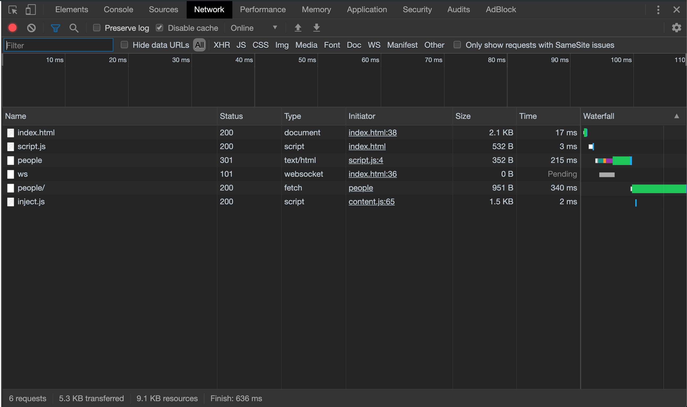
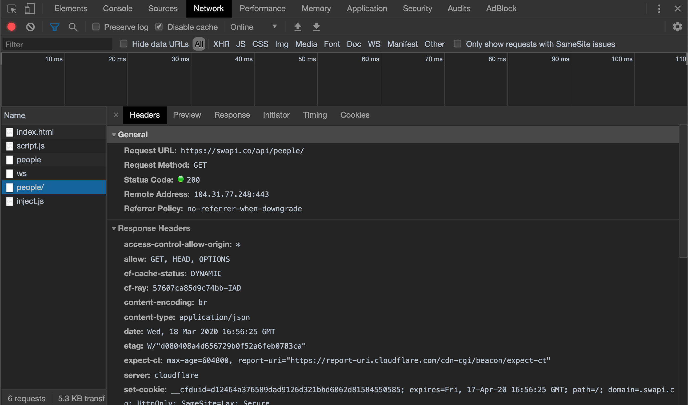

[](https://generalassemb.ly/education/web-development-immersive)

# Intro to APIs

Right now, the content on our web pages have been limited to what we create ourselves.
Today, we're going to learn how to request information from third-party
databases, and how to make our applications more dynamic by making it so our
application doesn't need to refresh the page to make a request to an API server!

## Objectives

By the end of this, developers should be able to:

- Explain what an API is and how to use one
- Describe what *AJAX* is and how to do use it. 

## What is an API?

**API** stands for "Application Programming Interface" and is a way of
describing software design. At the highest level, an API is any application with
a set of instructions for how programmers can interact with it. 
The DOM is actually an example of an API.

When we're talking about the web (and web APIs), we're generally talking about
an application that we interact with through it's *endpoints*. 
However, requests to an API's endpoints won't respond with HTML files, they'll respond with data.

### API Data

An API will receive a scripted request and send a response. But what makes an
API different from a full-stack application, is that an API won't render views,
it'll just send back data. That data will generally be in one of two forms: XML
or JSON.

#### XML

**XML** stands for "eXtensible Markup Language" and is the granddaddy of
serialized data formats (itself based on HTML). XML is fat, ugly and cumbersome
to parse. It is increasingly the less common of the two formats you'll
encounter. It is still a major format due to its legacy usage across the web.
You'll probably always favor using a JSON API, if available.

XML looks like this:

```xml
<users>
  <user id="23">
    <name><![CDATA[Bob]]></name>
  </user>
  <user id="72">
    <name><![CDATA[Tim]]></name>
  </user>
</users>
```

#### JSON

**JSON** stands for "JavaScript Object Notation" and has become a universal
standard for sending and receiving data across the web. It is light-weight,
easy-to-read and quick to parse.

JSON looks like this:

```json
{
  "users": [
    { "name": "Bob", "id": 23 },
    { "name": "Tim", "id": 72 }
  ],
  "content": "This is a piece of content"
}
```

#### What is Serialization?

> the process of translating a data structure or object state into a format that can be stored (for example, in a file or memory data buffer) or transmitted (for example, across a computer network) and reconstructed later (possibly in a different computer environment)

All data sent via HTTP is sent as strings. Unfortunately, what we really want to
pass between web applications is **structured data** (i.e., arrays and hashes).
In order to do so, native data structures are **serialized**: converted from a
JavaScript object into a string representation of the data. This string can be
transmitted and then parsed back into data (de-serialized).


### Working with an API

APIs can be either public or private. If an API is public, anyone can access the
data behind it. If an API is private, then you'll need to get a password (called
an API Key) or go through some other form of authorization before you can access
data through that API.

Here is a good list of [Free APIs](https://github.com/toddmotto/public-apis)

We'll start by exploring a public API: [The Star Wars API](https://swapi.dev/)

#### You do: The Star Wars API

For the next 10 minutes, explore the Star Wars API. Try the links out in the browser
as well as on the Star Wars API page.

> In order to format JSON in the browser nicely, you might need a plugin like
> [JSON View](https://chrome.google.com/webstore/detail/jsonview/chklaanhfefbnpoihckbnefhakgolnmc)
> for Google Chrome (or just use [Firefox](https://www.mozilla.org/en-US/firefox/new/))

1. How do you get data for all the people in the Star Wars universe?
1. What about for a specific person?
1. How do you get data about a specific planet?
1. How do you get data about a specific starship?
1. What type of request is being made when you open a url in the browser?

## What is AJAX? (15 minutes, 0:55)

**AJAX** stands for "Asynchronous JavaScript and XML".

Back in the early- and mid-1990s, the only way for a user to request new data
was through the server-based request-response cycle. The user would click on a
link or change some data in the UI and the whole page would reload. This was
inefficient for the user and the User Experience; it was also an inefficient use
of bandwidth, as an entire rendered page had to be transmitted rather than just
the new or updated data.

This is where AJAX came in to play. AJAX is a way for us to make HTTP requests
in JavaScript. So we can make requests to our server (asynchronously) without
having to reload the page!

AJAX was first implemented in Internet Explorer as the `XMLHttpRequest` object
and later adopted by Mozilla and Safari. In 2005, Gmail and Google Maps were
rebuilt using `XMLHttpRequest` and a developer named Jesse James Garret wrote an
article titled
_"[Ajax: A New Approach to Web Applications](https://designftw.mit.edu/lectures/apis/ajax_adaptive_path.pdf)"_,
where he coined the term _AJAX_.

Building apps with `XMLHttpRequest` lead to a better user experience and faster
applications but it was extremely verbose and cumbersome to work with. To make
it easier, jQuery implemented the `.ajax()` api, abstracting away
`XMLHttpRequest` into a chainable set of function calls.

Then, WHATWG (the standards body for HTML) introduced the `fetch()` api
as a browser-native implementation of AJAX similar to the jQuery API. Fetch has
gained a lot of popularity in the past few years because its easy to use and
doesn't require loading in jQuery. Today we will focus on fetch for our api
calls.

Here's an example of XMLHttpRequest in action. Note how annoying this would be
to work with.

```js
function reqListener() {
  const response = JSON.parse(this.responseText)
  console.log(response);
}

var oReq = new XMLHttpRequest();
oReq.addEventListener("load", reqListener);
oReq.open("GET", "https://swapi.dev/api/people/1");
oReq.send();
```

### I Do: Lets See It in Action

We will use Javascript's `fetch()` method to make AJAX calls to an API. There
are several standard requests we can make, including GET, POST, PUT, PATCH and
DELETE. Today, we're only going to be making GET requests.

> What is a GET request?

First, let's set up a mini page to make requests from.

- Make a new directory called `js-star-wars-api` in your sandbox.
- Create an `index.html` and a `script.js` file. Link your script in your html
  file.

Add the following code to your script file!
Then open your `index.html` via `Live Server` extension or `Finder` and open the console

```js
const url = 'https://swapi.dev/api/people'


fetch(url)
    .then(response => {
        console.log("success!", response)
    })
    .catch(error => {
        console.error("Something went wrong...", error)
    })
```

Every AJAX request needs:

- A URL (where we're making our request to)
- The type (or method) of our request and any headers that get sent with our
  request.
- Sometimes, **headers** are used to tell the server we're requesting data from
  to give us a certain format of data back (JSON or XML).

The default type or request fetch makes is a GET request. We can also squeak by
with the default headers (in this case, we're not passing any) for our GET
request because the Star Wars API is not strict in what it asks from us.

Open your browser console and you should see the response getting logged!

Now check out the network tab and you'll see something like this:



This is a list of all the requests your browser has made since loading this
page. Click on any of them to see details.

The very first one is the html document itself. Loading that document will
trigger other requests, like a script or a css file or any images the document
might contain.

Now click on the one that says `people/`, this is the AJAX request to the Star Wars API:



You can see the request and response headers. All of this data is sent with
every request!


## [License](LICENSE)

1. All content is licensed under a CC­BY­NC­SA 4.0 license.
1. All software code is licensed under GNU GPLv3. For commercial use or
   alternative licensing, please contact legal@ga.co.
