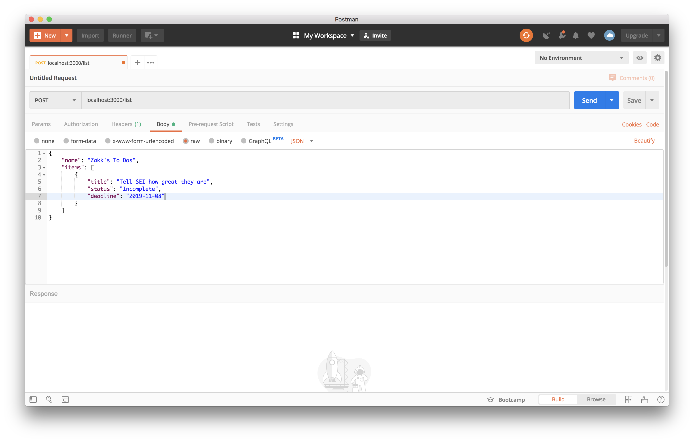

[](https://generalassemb.ly/education/web-development-immersive)

# Express: Create and Read

This lesson will cover the two most important aspects of any API: reading and
creating data.

## Prerequisites

- Node
- MongoDB and Mongoose
- Express

## Objectives

By the end of this, developers should be able to:

- Define list and detail routes in an Express API
- Define a create route in an Express API

## Introduction

We've discussed the four components of CRUD before:

1. Create
1. Read
1. Update
1. Delete

We're going to focus on Create and Read first. All of the APIs we've interacted
with so far have had robust methods of reading data from them - that is, in
fact, exclusively what we've used them for! With reading data, creating new data
in an API is extremely important.

## We Do: Express, Mongoose setup

Before we get started, let's build out our base Express app. We already have
a `package.json` in this repository.

- How do we establish our database connection?
- How do we setup a basic Express server?
- Let's define a List model with a `name` property and `items` subdocument with
    `title`, `status`, and `deadline` properties.

## Resourceful Routing

We've seen this table of the [Golden
Seven](https://medium.com/@shubhangirajagrawal/the-7-restful-routes-a8e84201f206) named routes in REST:

| URL | Path | Method  | Action | Description |
| --- | --- | --- | --- | --- |
| `/resource` | `/` | `GET` | #index | List all items of `resource` |
| `/resource/new` | `/new` | `GET` | #new | Render form to create a new instance of `resource` |
| `/resource` | `/` | `POST` | #create | Create new `resource` in the database |
| `/resource/1` | `/:id` | `GET` | #show | Show a single `resource` |
| `/resource/1/edit` | `/:id/edit` | `GET` | #edit | Render form to update a single `resource` |
| `/resource/1` | `/:id` | `PATCH`/`PUT` | #update | Update `resource` in the database |
| `/resource/1` | `/:id` | `DELETE` | #destroy | Delete a `resource` |

Based on the descriptions, which of these routes are related to reading data?
Which are related to creating data?

<details>
<summary>Solution</summary>

**Read:**

| URL | Path | Method  | Action | Description |
| --- | --- | --- | --- | --- |
| `/resource` | `/` | `GET` | #index | List all items of `resource` |
| `/resource/1` | `/:id` | `GET` | #show | Show a single `resource` |

**Create:**

| URL | Path | Method  | Action | Description |
| --- | --- | --- | --- | --- |
| `/resource` | `/` | `POST` | #create | Create new `resource` in the database |

</details>

These routes map to the code we will write in our Express API, as you'll see.

## Reading Data from an API

There are a number of ways that we can set up an API so that our users can pull
data from it. We're going to focus on REST and the most common ways: list and
detail routes.

A **list** route _lists_ all the objects of a certain resource. A **detail**
route, provides the _details_ of a specific instance of a resource.

Let's work through both.

### List Routes

As I said before, the purpose of the list route is to _list_ all the objects of
a certain resource. Your feed on Facebook is one version of a list route.
Typically, the path for the list route of a resources is just the resource name
(i.e. `/tweets`).

The route we define in Express will query our model for all instances of a given
resource and return that list back to the user. Here are two examples:

1. [PokeAPI Pokemon list route](https://pokeapi.co/api/v2/pokemon)
1. [Star Wars People list route](https://swapi.co/api/people/)

To build this out ourselves, we define a route with the path for our resource
and query our model, returning the results to our user:

```js
// index.js
const List = require('./models/List')

app.get('/list', (req, res) => {
  List.find({}).then(lists => {
    res.json(lists)
  })
})
```

### Detail Routes

The purpose of the detail route is to return a single object, based on an ID in
the URL's path. Here are two examples:

1. [PokeAPI Bulbasaur](https://pokeapi.co/api/v2/pokemon/1)
1. [Star Wars API Luke Skywalker](https://swapi.co/api/people/1/)

Notice the URL path?

We can implement something like that ourselves:

```js
app.get('/list/:id', (req, res) => {
  List.findById(req.params.id).then(list => {
    res.json(list)
  })
})
```

Test it out in the browser!

### Aside: Query and Search Routes

The detail route works great for most cases. But there will be times when you
want to look up a document by some property other than it's ID. How do we do
that?

We have a few options here:

1. [Query Strings](https://expressjs.com/en/4x/api.html#req.query)
1. Named Routes

We'll leave query strings as a fun bonus for now and look at named routes.
Here's an example:

```js
app.get('/list/name/:name', (req, res) => {
    List.find({name: req.params.name}).then(lists => {
      res.json(lists)
  })
})
```

This works well when we only want to query by a few properties. When we want to
let the user query by any property of the document, we should look into query
strings.

## Creating Data in an API

Now, let's turn to creating data in our API! This will be a little different
from the routes we've defined so far. We're going to use Express' `post` method,
instead of `get`. That's because a user is going to create some data by making
a `POST` request to our route.

```js
app.post('/list', (req, res) => {
  List.create(req.body).then(list => {
    res.json(list)
  })
})
```

### Aside: Middleware and Body Parser

That's how we define the route, but it wont work just yet. It wont work because
Express doesn't have a way to parse the body (i.e. `req.body`). For that we need
[middleware](https://expressjs.com/en/guide/using-middleware.html): a function
that has access to the request and response object and performs some action as
part of the request-response cycle.

For context, when we send data to an API in a `POST` request, that data is the
`body` of the request. That body will always be a string (or stringified JSON).
And by default, Express wont do anything with it - we have to tell Express we
want to use it:

```js
app.use(express.json())
```

When we pass a function into `app.get` or `app.post`, that function is
middleware.

### Aside: Postman and Testing our Endpoint

We can test out `GET` requests through the browser, but we can't do that for
`POST` requests (yet!). To test out our `POST` requests, we need a separate
tool: [Postman](https://www.getpostman.com/)



Let's test out sending a `POST` request to our API!

## Creating Nested Documents

We can now create new lists with our API, but we can't create items in those
lists yet. Some developers might implement this with a `PUT` or `PATCH` request,
since we are technically _updating_ a List, but we can also do this with
a `POST` - we are also _creating_ an item.

This will combine the detail path (i.e. `list/:id`) with a `POST` request. We
want to add the item to a specific list:

```js
app.post('/list/:id/item', (req, res) => {
  List.findByIdAndUpdate(
    req.params.id,
    { $push: { items: req.body } },
    { new: true }
  ).then(list => {
    res.json(list)
  })
})
```

## [License](LICENSE)

1. All content is licensed under a CC­BY­NC­SA 4.0 license.
1. All software code is licensed under GNU GPLv3. For commercial use or
   alternative licensing, please contact legal@ga.co.
