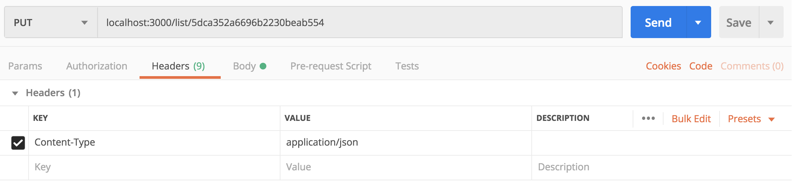
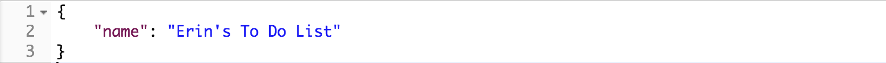

[](https://generalassemb.ly/education/web-development-immersive)

# Express: Update and Delete

This lesson will cover the two final functionalities of your API and the remaining parts of CRUD: updating and deleting data.

## Prerequisites

- Node
- MongoDB and Mongoose
- Express

## Objectives

By the end of this, developers should be able to:

- Define an update route in an Express API
- Define an delete route in an Express API

## Introduction

So far, we have learned how to read and create data in our APIs. Next, we want to add some routes in order to incorporate the functionality to update and delete our data. Before we do that, let's review.

### Review: Resourceful Routing

We've gone over this table of the [Golden
Seven](https://restfulrouting.com/#golden-seven) named routes in REST a few times now:

| URL | Path | Method  | Action | Description |
| --- | --- | --- | --- | --- |
| `/resource` | `/` | `GET` | #index | List all items of `resource` |
| `/resource/new` | `/new` | `GET` | #new | Render form to create a new instance of `resource` |
| `/resource` | `/` | `POST` | #create | Create new `resource` in the database |
| `/resource/1` | `/:id` | `GET` | #show | Show a single `resource` |
| `/resource/1/edit` | `/:id/edit` | `GET` | #edit | Render form to update a single `resource` |
| `/resource/1` | `/:id` | `PATCH`/`PUT` | #update | Update `resource` in the database |
| `/resource/1` | `/:id` | `DELETE` | #destroy | Delete a `resource` |

Based on the descriptions, which of these routes are related to updating data?
And which are related to deleting data? When we update and delete, are we affeting a single resource or the entire resource as a whole?

<details>
<summary>Solution</summary>

**Update:**

| URL | Path | Method  | Action | Description |
| --- | --- | --- | --- | --- |
| `/resource/1` | `/:id` | `PATCH`/`PUT` | #update | Update `resource` in the database |

**Delete:**

| URL | Path | Method  | Action | Description |
| --- | --- | --- | --- | --- |
| `/resource/1` | `/:id` | `DELETE` | #destroy | Delete a `resource` |

</details>

### Getting Started

1. Clone [this repo](https://git.generalassemb.ly/sei-buffleheads/express-create-read) into your sandbox.
1. Change into the new directory and run the command `git checkout solution`.
1. Run `npm install`.
1. Run `mongod` to start your MongoDB server.
1. In a separate tab, run `node db/seed.js` to seed your data to your local database.
1. In a separate tab, run `nodemon index.js` to start your server.
1. Navigate to `http://localhost:3000`.

Let's take a look at the routes we already have in place and use our paths to access our lists and details from our API.

## Updating Data in an API

We can see that we have some data in our API already. Let's say we want to change the name of the to do list. I would most likely want to **update** the status of that item to be complete. Let's create and update route using a `PUT` request and then test it in Postman!

What is `req.body` here?

```js
app.put("/list/:id", function (req, res) {
  List.findOneAndUpdate(
    { _id: req.params.id },
    req.body,
    { new: true }
  ).then(list => {
    res.json(list)
  })
})
```

In Postman, set your Content-Type to application/json under the Headers tab.



Then, simply add your update to the body and submit!



<!-- A more likely scenario would be to update the status of a to do list item to `Completed` once we are able to check it off our list!

```js
// Enter code here
``` -->

## Deleting Data in an API

Finally, we will want to write a route that will help us to **delete** a piece of data. You will want to set up Postman in the same with, setting the Content-Type to application/json.

```js
app.delete("/list/:id", function (req, res) {
  List.findOneAndRemove({ _id: req.params.id })
    .then(list => {
      res.json(list)
    })
})
```

<!-- Or similarly to what we just did with udpate, delete a single to do list item:

```js
// Enter code here
``` -->

## Closing

Look at you! Building a fully functioning API with full CRUD and RESTful routing! Amazing! We've mentioned this before, but these are the patterns you will need to follow when developing your very own API. You've now built out an Express back end, and you are one step closer to putting together your first full stack application!

## [License](LICENSE)

1. All content is licensed under a CC­BY­NC­SA 4.0 license.
1. All software code is licensed under GNU GPLv3. For commercial use or
   alternative licensing, please contact legal@ga.co.
