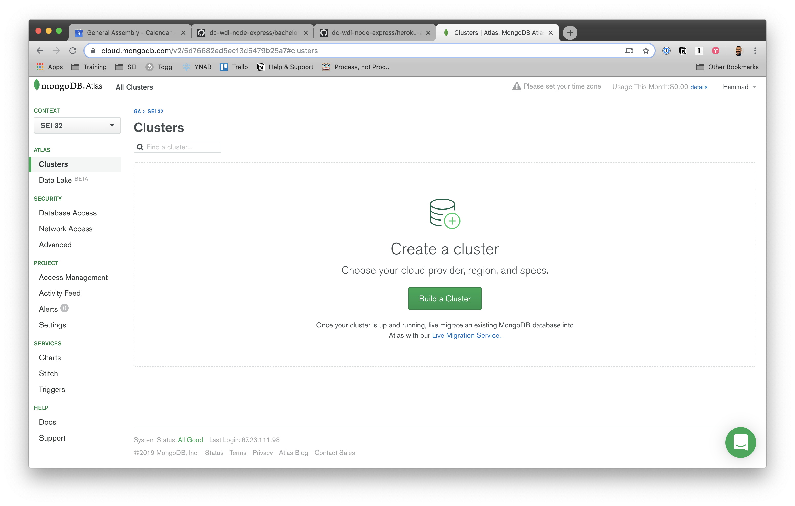

# Deploying Node and MongoDB to Railway 


## Learning Objectives

- Define deployment
- Describe the difference between development, test, and production environments
- Use environmental variables to keep sensitive data out of code
- Set up a Mongoose database using Atlas
- Deploy a Node App using  Railway

## About Deployment

### What is Deployment?

Deployment is the act of putting an app up on one or more internet-connected
servers that allow users to access and use the app.

_Question:_ What changes in an application when it is deployed?

### Requirements for Deployment

There are generally a few things we need for an app to be properly deployed:

- **Server** - the server(s) must be on and connected to the internet
- **Executable Code** - we must get our code onto the server and be able to run it
- **Dependencies** - the server(s) must have the proper dependencies installed
- **Services** - the server(s) must be running the correct services (web, database, email, etc.)
- **Configuration** - we must configure our running app with respect to its deployment environment

### Deployment Approaches

There are lots of ways to do each of these steps. For example, we can get our
code onto a server by...

- Using FTP (File Transfer Protocol) to transfer the files onto the server
- Adding a git remote repository and using `git push` to transmit files (like with GH pages)
- Putting the files on a flash drive, fastening it to a homing pigeon's leg,
  then having an operator receive the pigeon and copy the files over to the server

## Environments and Environmental Variables

### Environments

Application environments are an important part of the context in which an application runs.
Each environment is configured to support a certain usage of the application.

Typical application environments include:

- **Development** - environment where an app or new feature(s) are created and run locally
- **Test** - environment where code and UI is tested for functionality and performance
- **Production** - environment for complete and tested code to be hosted online for clients to use

So far, we haven't been specifying any environment.
Today we'll look at deploying to the `production` environment, 
a.k.a. the public, published version of our site.

Each environment has a different set of configurations, things that vary
depending on how we're running or using our app. We could be developing,
testing, or deploying our apps. Configuration settings often include...

- The name of the database
- The username/password to connect to the database
- API authentication keys (e.g. to connect to twitter API)
- Whether or not to reload code on each request (for debugging vs performance)
- Where to save log information (error logs, etc)

### Environmental Variables

We do not want to keep configuration in our codebase (e.g. the code we see when
we push to GitHub) for several reasons:

- We do not want to expose private information such as passwords and API Keys.
- When we push the same code to differnt environments, we need a way to
  dynamically tell which environment we're in.

Node manages application environments using "environmental variables".

Environmental variables store data and configuration information that is defined
outside of your codebase and pertain to the phase of the application's
development.

Storing this information separately protects sensitive information like API keys
and passwords because it is not visible from your project directory.

This is accomplished using `process`, a global object that comes with all node
projects. `process` has a property `env` where we store environmental variables.

We can view a project's environmental variables using the node repl in our
terminal. In your terminal,

```bash
$ cd <your-node-project>
$ node
> console.log(process.env)
```

- _Question:_ What are some of the listed variables? Why would they be stored here?

You can create a new environmental variable in the terminal too! (terminal, not node!)

```bash
$ export <YOUR_ENVIRONMENTAL_VARIABLE_NAME>=<variableValue>
```

#### Note:

- Make sure there are no spaces next to the equals sign!

- Environment variables tend to be SCREAMING_SNAKE_CASE by convention.

To test, try logging the following code from the node repl.

```js
> process.env.<YOUR_ENVIRONMENTAL_VARIABLE_NAME> = // whatever
```

If you'd like, you can also remove the environmental variable by exiting out of
the Node CLI and entering this command in the normal terminal:

```bash
$ unset <YOUR_ENVIRONMENTAL_VARIABLE_NAME>
```

#### `dotenv`

[dotenv](https://github.com/motdotla/dotenv) is a Node package used to store sensitive information in the environment. It loads environment variables from a `.env` file into `process.env`.
It is a fantastic practice, and accords with [12-factor principles](https://12factor.net/).

We can install it as a dependency for our project with the command `npm install
dotenv`.


## Deploying Applications

Now that that's done, lets get our project deployed! We're going to be deploying
our Node-Express-Mongoose application on [Railway](https://railway.app/) and
connecting it to our Mongo database that we'll be deploying on [MongoDB
Atlas](https://www.mongodb.com/atlas) to get it done.


### Railway

[Railway](https://railway.app/) is a service that makes the deployment process
easy by doing a lot of the work for you. It's got a free tier for small projects
like the ones we've been working on but is also used for larger, professional
applications. It...

- Starts up a new server and installs all the necessary services
- Tracks the projects git repo and automatically redeploys when a change has
    been pushed up.

### Mongo Atlas

[Mongo Atlas](https://cloud.mongodb.com) is a cloud-based database service that
hosts a protected MongoDB instance that you can easily integrate with an
application deployed on Railway.

Today, you will need to set up an Atlas account and database to host your database.

### Deployment in 19 Easy Steps

Deployment is essentially an exercise in following directions. Follow the
step-by-step instructions below to deploy your app. Pay attention to
the notes following each prompt! Fully read each prompt (including the notes)
before executing each step.

#### Set up MongoDB Atlas

1. Go to [Mongo Atlas](https://cloud.mongodb.com) and sign up for an account, or
   sign in if you have one already.

2. In the sidebar on the left, open the dropdown menu title `context` and select
   `New Project`. Give it a name and click `Create Project`. You can leave the
   defaults in the "Create a Project" page and hit the "Create Project" button.

   

3. Finish creating your new project and click the `Build a Cluster` button. **Be
   sure to select the free option for building your cluster!** Otherwise, leave
   all the default settings. Your cluster could take a few minutes to to finish
   building.

   

4. When your cluster is finished, click the "Connect" button.

5. Add `0.0.0.0/0` for the whitelisted IP address. This represents all of the IP
   addresses on your local machine. If you just add the current IP address you
   can click on "Network Access" in the sidebar, then the "Add IP Address"
   button in the top right, and finally "Allow Access from Anywhere" and click
   Confirm.

##### NOTE:

- If you forget to whitelist the IP, go to "Network Access" under "Security" on
  the left sidebar. Next select "Add IP Address" in the top right corner, and
  there should be a "Allow Access from Anywhere" button (or you can enter
  `0.0.0.0/0` manually).

6. Also create a username and password. **Remember the username and password you
   use for your database, you'll need them in a later step!**

   Go to "Database Access" under "Security" on the left sidebar. Then hit the
   "Add New User" button on the top right.

   ##### NOTE:

   - This is **not** the user with which you logged in to Atlas. "User" refers
     to an app that has access to your database, and **not your Atlas
     account/username**.

   - Create a Database username and Database password that you will remember, or
     write it down somewhere. You will need this information again later.

   - Do not use any special characters! Special characters can complicate the
     process when configuring your Atlas database with Railway.

   - Do not check 'Make read-only'. Full CRUD functionality will not work with a
     read-only database. Making this user admin is perfect!

#### Set up Railway

7. Head over to [Railway.app](https://railway.app/) and click on the "Start a
   New Project" button.

8. Select the "Deploy from GitHub repo" optioni, log in with your
   personal GitHub account, and grant the authorization that Railway is
   requesting. 

   >You may need to verify your github account. Follow the steps they present you if so.

9. From the dashboard select the "New Project" button and from there, select the
   "Deploy from GitHub repo" option. You'll then need to configure how Railway
   interacts with your GitHub account. You can either choose to allow Railway
   access to all repos on your account or just the specific ones you choose. 

If we were to select the "Deploy Now" option, our site wouldn't work just yet. We need to first change some things about the way our project is set up, then add some environment variables to our Railway configuration.

#### Environment Variables

We need to let our Node app know _when_ to use Mongo Atlas as our database,
and when to use our local DB.

10. Navigate to your projects repository on your local machine and run 

`npm install dotenv`

This will allow us to access environment variables stored in a `.env` file and,
while project is deployed, allow us to access the environment variable set up in
the Railway configuration. 

11. Now we need to edit the file in our project that connects to the Mongo
    database (usally `database.js` or `connection.js`) so that when the
    application is deployed it will try to connect to the database hosted on
    Mongo Atlas rather than `localhost`. We can do that by adding a simple
    conditional, taking code that looks like this:

    ```js
    const connectionString = 'mongodb://127.0.0.1:27017/example'

    mongoose.connect(connectionString , mongooseConfig)
    ```
    and making it look like this:
    
    ```js
    const url = process.env.MONGO_URL || 'mongodb://127.0.0.1:27017/example'

    mongoose.connect(url , mongooseConfig)
    ```

12. Next, we'll edit the file that sets up your express server (usually `server.js` or
    `index.js` in a similar fashion. This time we'll set up our application's
    port to be an environment variable by changing this:
    
    ```js
    app.listen(3000, () => console.log('app listening on port 3000'))
    ```

    to look like this:

    ```js
    const port = process.env.PORT || 3000

    app.listen(port, () => console.log(`app listening on port ${port}`))
    ```

13. Add and commit all the changes you've made to your local repository and push
    them up to your GitHub.

#### Railway & Atlas Configuration

14. Go back to your Atlas database in your browser. Click on "Connect" and then
    "Connect Your Application" then **copy the connection string!**

    

    ##### Note:

    - You must copy this from your own database to capture your unique database id numbers.


15. Go back to your Railway tab and select "Add variables". Create a new
    variable with a key of `MONGO_URL` and paste the connection string you got
    from Mongo Atlas. 

    - you will still need to manually substitute the `<password>`
      with the one you created earlier on.

16. Now we need to seed our database. If we were doing that locally, we would
    simply run our the `seed` command in the terminal. To run it on our
    deployed application, we need to install the [Railway cli
    tool](https://docs.railway.app/develop/cli), which we can do with brew.
    
    `brew install railway`

    Then login from the command line.

    `railway login`

    From inside your project directory, link up to Railway.

    `railway link`

    Then select your project name from the menu. Now you're able to run any code
    from insed your Railway environment with the command `railway run
    <command>`. Run you `seed` script!

    `railway run npm run seed`

17. We're almost done! All that's left is to generate our domain. On the railway
    page, select the settings tab for the application, then select the "Generate
    Domain" option in the "Environment" section. 


19. You just successfully deployed your first app! You should be proud, so pat
    yourself on the back, give your neighbor a high five, call your parents, and
    share this milestone with someone you love!

    

## Solving Deployment Issues

**Not working?** Don't worry! Debugging is a part of your life now. Check out
these tips on solivng deployment issues.

### Google is Your Best Friend

More often that not, solving deployment issues requires a good deal of Googling.
Don't expect to find a silver bullet -- often we must go through many different
issues other users may have encountered to understand our own.

What should you Google?

- If you aren't able to deploy, Google the error that shows up in the deployment
    logs.

### Help Each Other Out!

If you notice somebody running into the same problem as you, try working
together on debugging it!

## Additonal Resources

- [About Environments](about-environments.md)
- [12-Factor Apps in Plain English](http://www.clearlytech.com/2014/01/04/12-factor-apps-plain-english/)
- [12-Factor Principles](https://12factor.net/)

## License

1. All content is licensed under a CC­BY­NC­SA 4.0 license.
2. All software code is licensed under GNU GPLv3. For commercial use or
   alternative licensing, please contact [legal@ga.co.](mailto:legal@ga.co)
