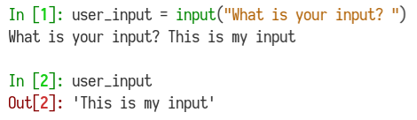

[](https://generalassemb.ly/education/web-development-immersive)

# Intro to Python

You've learned a lot in this class so far - languages, libraries, frameworks, etc. Today, we're going to start learning another programming language: Python! Learning Python is going to happen more quickly than learning JavaScript. That's because you already know how to program! Now, you simply need to learn a new language. As you work through this unit, keep in mind that many of the concepts are the same as what you have learned so far. The differences will come with the way we write our code and the way the parts of your application will work together.

## Objectives

By the end of this, developers should be able to:

- Describe the history, background, and use-cases of Python
- Compare and contrast Python with a previous language
- Write basic programs in Python

## What is Python?

Python is a high-level, general purpose programming language created by Guido
van Rossum in 1991. Depending on who you ask, it's the [most
used](https://www.stackscale.com/blog/most-popular-programming-languages/) most
used programming language up there with JavaScript, Java, and C. Python can be
used for data science, devops, or general purpose programming. In this class, we
will be using it as a server-side, "back-end" programming language.

### Getting Python

Before we begin, let's ensure Python is installed on your computer:

```sh
$ which python3
```

If it is _not_ installed, go ahead and install it:

```sh
$ brew install python3
```

Note that `python` and `python3` are different commands that run different versions of Python. 
The `python` command runs Python 2, which we're not using for this course.


### Interacting with Python

There are a few ways that we can interact with Python:

#### By File

The first way that we can interact with Python is by running a Python file.
Python files have the extension `.py` and can be run through the command line:

```bash
cd code/
mkdir py-test
cd py-test
touch app.py     # Create a Python file
python3 app.py   # Run that Python file
```

> NOTE: Running an empty Python file will not result in anything so don't worry
> if nothing happens if you run `python3 app.py` above.

#### By REPL (Read-Evaluate-Print-Loop)

The second way that we can interact with Python code is with a tools like
IPython or the Python shell. These are both REPLs. Have we used these before?

```bash
python3                # start Python3 REPL
exit()                 # quit Python REPL

pip3 install ipython  # install IPython with Pip (you may need a sudo on linux)
ipython               # start IPython REPL
exit                  # quit IPython
```

- Pip3 is a package manager for Python3 just like NPM is a package manager for
node. If it's not installed, you can install it with `brew install pip3` on MacOS and `sudo apt install python3-pip` on Linux.


- IPython is an alternative Python shell that adds a bunch of features like tab
completion, better syntax highlighting, and the ability to inline embed
graphics.

We'll use IPython for the first portion of this lesson.

## Fundamental Characteristics of Python

### Variables

Variables in Python are assigned by using a single equals sign (`=`):

```python
my_favorite_animal = "flying squirrel"
# => "flying squirrel"
```

Notice a few other things about the above block of code:

- We no longer need to precede new variables with `var`, `let`, or `const`. 
  Just use the name of the variable!
- Variables are instantiated as they are used.
- Variables are also written in `snake_case`. 
- That means all lower case with words separated by underscores.
- Variable names should still be semantic.

### No Semicolons

While your code will work if you close a line with `;`, common practice is not to use them.

## You Do: Data Types (20 min / 0:30)

Start the IPython REPL in your terminal and start working through the prompts below.

<details>
<summary>Why do we have to read all this ourselves?</summary>

This is part of the gradual release of responsibility that we have discussed and
that you have experienced during your projects, this is the part where you
become developers and you don't rely on others to teach you. Developers have to
teach themselves all the time. Right now, you are doing that in an environment
where you have support.

While we could re-teach you what numbers, strings, conditionals, etc. are like
in Python, you know enough about programming languages from your experience with
JavaScript to pick up on this information pretty quickly on your own. Honestly,
if we taught it to you, you'd get bored really quickly.

Because of this, the peculiarities of Python will be apparent. These are the
things you need to be aware of in the next few classes.

</details>

<details>
<summary>Do I have to do the exercises? Can't I just read the code?</summary>

Just reading the code won't lead to learning it, so type everything out into the
IPython REPL!

</details>

### Everything Is An Object!

Everything in Python is an **object**.

- By "object" we mean that everything has its own set of properties and methods
- Not a new concept. Data types in JavaScript had their own properties and
  methods (e.g., `string.length` or `function.bind()`)
- You will learn more about this when you dive into Python OOP later this week

### Numbers

Python uses similar arithmetic operators to JavaScript

- `+`, `-`, `*`, `/`, `%`
- Same order of operations too: P.E.M.D.A.S.

```py
1 + 2 # Addition
# => 3

6 - 5 # Subtraction
# => 1

5 * 2 # Multiplication
# => 10

30 / 5 # Division
# => 6.0

31 // 5 # Note: Integer Division
# => 6

30 % 5 # Modulo (Remainder)
# => 0

31 % 5
# => 1

3 ** 2 # Exponentiation
# => 9
```

> Are any of these different in JavaScript?

### Strings

Text, just like in JavaScript.

- Surrounded by single or double-quotes
- Python uses similar escape characters
  - [Here is a list of them](http://python-reference.readthedocs.io/en/latest/docs/str/escapes.html)

```py
name = "John"
# => "John"

full_name = "John\nDoe"
# => "John\nDoe"

print(full_name)
# John
# Doe
```

Not only can you concatenate strings, now you can multiply them too! Remember we
couldn't do that in JavaScript?

```py
# Concatenation
"Hello " + "there!"
# => "Hello there!"

# Multiplication
"Hello there! " * 3
# => "Hello there! Hello there! Hello there! "
```

#### String Interpolation

Sometimes you will want to print out a string that incorporates a variable. For
example:

```py
my_name = "Ali"
# => "Ali"

print("Hi my name is: " + my_name)
# Hi my name is: Ali
```

This works fine. Things aren't so simple when that variable is of a different
data type. Like a number:

```py
age = 32
# => 32

print("My age is " + name)
# TypeError: must be str, not int
```

This is something JavaScript would just handle for you, but Python is more strict. 
In this case, you either need to convert the variable to a string. 
There are three common ways:
  - The `str` function: `"My age is " + str(age)`
  - The `format` method: `"My age is {}".format(age)`
  - Using "f-strings": `f"My age is {age}"`
  
The best way of doing string interpolation in Python today is using f-strings.

> Is there a similar way to format strings in JavaScript?

```python
class_number = 22

f"I have taught SEI {class_number} times."

person1 = "Lauren"
person2 = "Frank"
occupation = "consultant"

f"{person1} is a {occupation}. {person2} is a {occupation} as well."
# => "Lauren is a consultant. Frank is a consultant as well."
```

F strings (or "formatted string literals") are also a newer way of doing string
interpolation in Python. They've been around since Python 3.6 so you won't see
them in older code, but they are super helpful. Check your version with `python3
--version` before trying this or it may not work!

```py
class_number = 29
print(f"I am teaching SEI {class_number}.")
```

> Note the `f` at the beginning of the string!

This is similar to Javascript template string syntax!

### Booleans

They are `True` and `False` (note the capitals!)

We'll be using them in conditionals and comparisons just like in JavaScript

Comparison operators in Python are nearly identical to JavaScript. However, the
check for equality is always for both value and data type (i.e. strict
comparison).

- `<`
- `>`
- `<=`
- `>=`
- `==`
- `!=`

> In JavaScript, what is the difference between `==` and `===` ?

Logical operators are also similar.

- and, or, not

|                      |              JavaScript              |           Python            |
| :------------------- | :----------------------------------: | :-------------------------: |
| logical operators    | `&&`, <code>&#124;&#124;</code>, `!` |     `and`, `or`, `not`      |
| relational operators |  `==` `!=` `>` `<` `>=` `<=` `===`   | `==` `!=` `>` `<` `>=` `<=` |

### None

`None` is Python's "nothing".

- The equivalent of JavaScript's `null`
- It is falsey
- Always written with a capital letter: `None`

### Conditionals

Pretty similar to JavaScript, with some differences:

- No parentheses or curly brackets required
- Begin blocks using `if`, `elif` and `else`
- Use colons after each condition
- Indentation matters! 4 spaces is the standard indent.

Here's an example where we check for height at a roller coaster:

> Write the above code in a `roller_coaster.py` file and run it from the command
> line.

```py
print("Welcome to the Iron Rattler! How tall are you (in feet)?")
height = int(input())

if height < 4:
    print("Sorry, you'll fly out of your seat if we let you on.")
elif height < 7:
    print("All aboard!")
else:
    print("If you value your head, you should not get on this ride.")
```

## Print and Input (`input` & `output`)

To print out to the console like `console.log()` does in JavaScript, we use the
`print` function:

```python
print("Hello, World!")
# Hello, World!
```

Python also makes it easy for us to accept user input from the command line
using `input`:



## I Do: Python Bouncer (15 min / 0:45)

Back during our first few lessons on JavaScript, you used conditionals and
variables to create a Bouncer.

We'll now write a program in Python to do the same! Make a Python file for this
in your sandbox called `bouncer.py`

Here's the recap of the bouncer rules:

> If the age variable is below 21, the program should output that the person
> cannot enter because they are too young, if they are over 21 they can enter,
> and if age is not a number it outputs an error.
>
> Bonus: if age is 18 or older, but under 21, output that the person can enter
> the bar but cannot drink!

## Functions (5 min / 0:50)

In Python, functions are defined like this:

```py
def double(number):
    return number * 2
```

- `def` - the Python equivalent of `function`
- `double` - the function name in the above example
- `number` - the parameter name in the above example
- Use a `:` instead of curly brackets `{}`

We invoke it like this:

```
double(3)
# => 6
```

You may have noticed that we use the same `return` notation as JavaScript.

Python functions can also establish default argument values. In the below
example, if we do not provide our `double` function with an argument, it will
default to 5

```py
def double(number=5):
    return number * 2

double()
# => 10
```

## Compare and Contrast (5 min / 0:55)


Turn to the person sitting next to you and compare and contrast what you know
about JavaScript with what you now know about Python. You can do this with a
table, a mind map or however you think is best.

Some things to think about:

- Syntax. How are they similar? How are they different?
- Functions & methods
- Terminology differences

## Conclusion

One of the things we said back when we were learning JavaScript is that it's
challenging to learn programming and a programming language at the same time
(but also necessary, there's no way around that). Now that you know programming
and a programming language (JavaScript), you only need to learn the new
programming language!

The more you use a language, the more comfortable you get with it. The more
comfortable you get with it, the easier it is to "think" in that language.

## Additional Resources

- [Python Docs](https://docs.python.org/3/)
- [Python Starter](https://git.generalassemb.ly/sei-buffleheads/python-starter)
- [Python Beginner Tutorial (Docs)](https://docs.python.org/3/tutorial/index.html)

## [License](LICENSE)

1. All content is licensed under a CC­BY­NC­SA 4.0 license.
1. All software code is licensed under GNU GPLv3. For commercial use or
   alternative licensing, please contact legal@ga.co.
